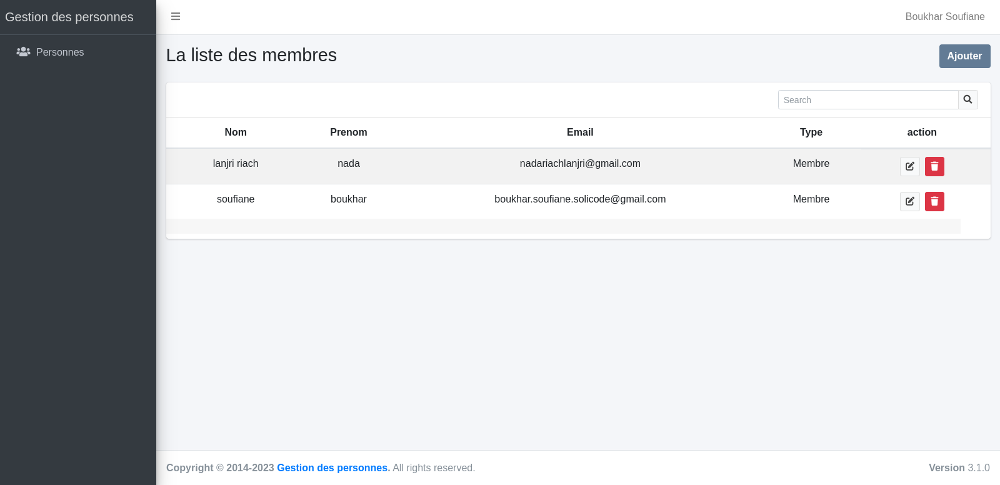
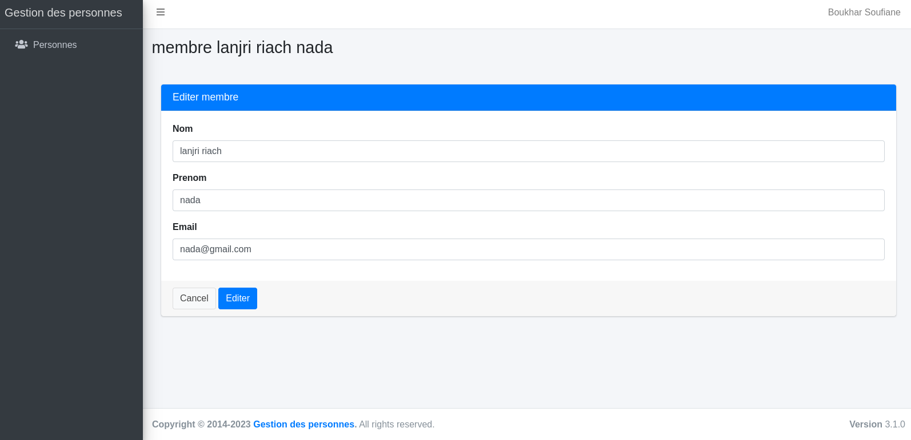
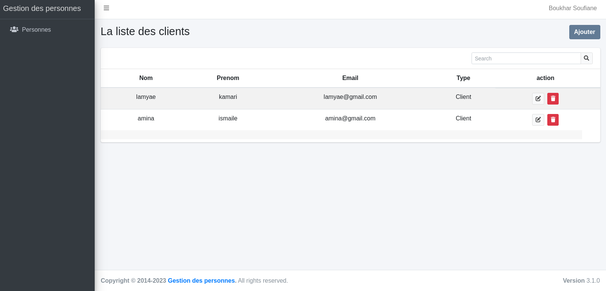
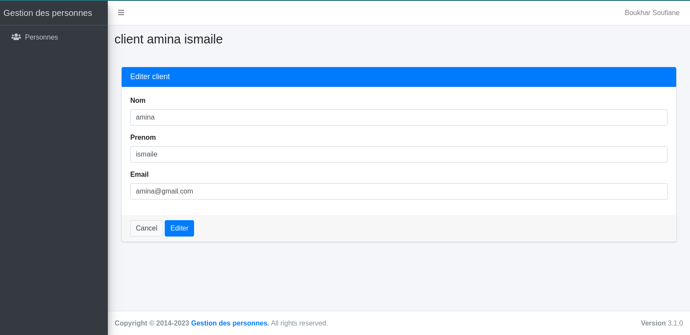
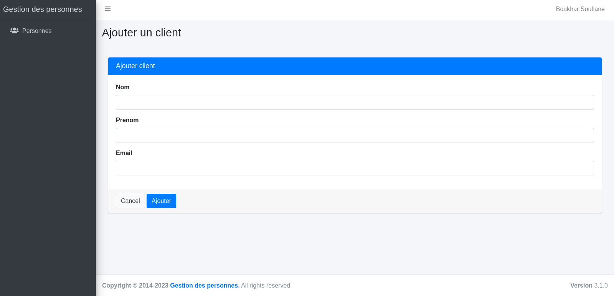

# Front-end

{:width="800px" }
*Front-end*

<!-- note -->

On va discouvrir les interface d'une application

<!-- new slide -->

## Interface de la liste des membres

{:width="900px" }
*List de membres*

<!-- note -->

Cette interface présente une liste des membres avec un bouton pour ajouter un nouveau membre, ainsi que des fonctionnalités de recherche et de pagination.

<!-- new slide -->

## Interface de modifier un membre

{:width="900px" }
*Editer un membre*

<!-- note -->

Cette interface présente une modification de membre.

<!-- new slide -->

## Interface ajouter un membre

{:width="900px" }
*Ajouter un membre*

<!-- note -->

Cette interface présente une ajoutation d'un nouveau membre.

<!-- new slide -->

## Interface de la liste des clients

{:width="900px" }
*List de clients*

<!-- note -->

Cette interface présente une liste des clients avec un bouton pour ajouter un nouveau client, ainsi que des fonctionnalités de recherche et de pagination.

<!-- new slide -->

## Interface de modifier un client

{:width="900px" }
*Editer un client*

<!-- note -->

Cette interface présente une modification de client.

<!-- new slide -->

## Interface ajouter un client

{:width="900px" }
*Ajouter un client*

<!-- note -->

Cette interface présente une ajoutation d'un nouveau client.

<!-- new slide -->

